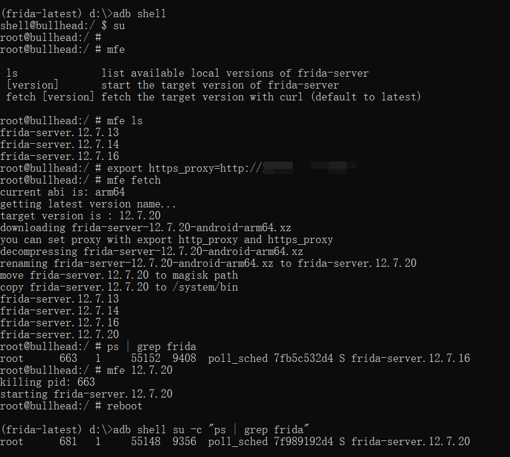

# `MagiskFridaEnv`


> forked from [`AeonLucid/MagiskFrida`](https://github.com/AeonLucid/MagiskFrida)

## Description

Runs frida-server on boot as root with magisk.   

And switch the version with `mfe`.   

For more information on frida, see https://www.frida.re/docs/android/.

## Instructions

Flash the zip for your platform using TWRP or Magisk Manager.

In order to build it:

```sh
git clone https://github.com/toolsRE/MagiskFridaEnv
cd MagiskFridaEnv
pip3 install -r requirements.txt

python3 build.py
# or
python3 build.py -a arm -a arm64 -v 12.7.16 -v 12.7.14 -v 12.7.13
# or
python3 build.py --help
```

Zip files will be generated in the same folder, grab the right architecture.  

## `mfe` 

```sh
adb shell su -c "mfe ls"
# frida-server.12.7.13
# frida-server.12.7.14
# frida-server.12.7.16

adb shell su -c "mfe 12.7.13"
# killing pid: 4690
# starting frida-server.12.7.13

adb shell su -c "mfe --help"
```



> Only been tested on `Nexus 5` and `Nexus 5X` with Android 6.0.1 and 8.0.1. 

## `mfe fetch` 

> If you want to use `mfe fetch`, you need to install [`Curl For Android`](https://github.com/Magisk-Modules-Repo/curl) with Magisk Manager first. 

> `x86` is not supported.

`mfe fetch` or `mfe fetch latest` will fetch the latest version of frida-server.  

Or pass the version you want:

`mfe fetch 12.7.18`